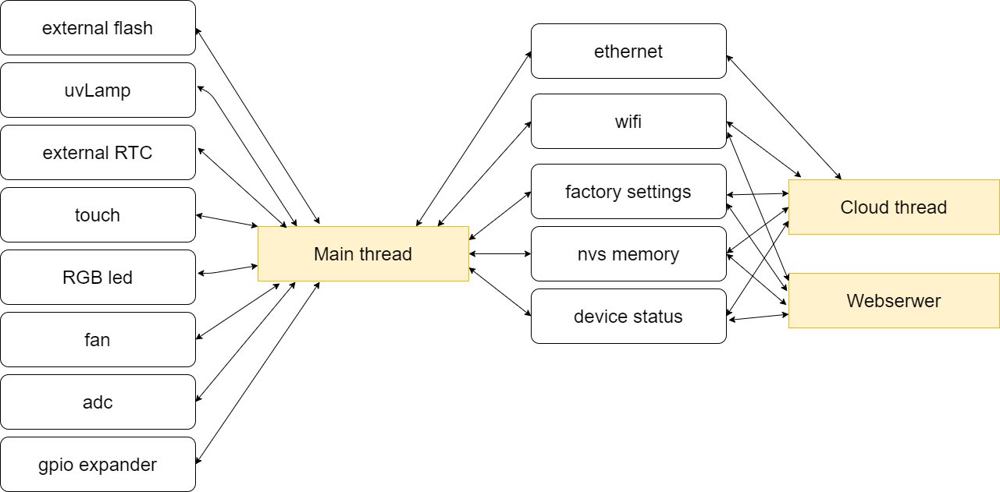

# Architecture
The main thread is responsible for the operation of the entire device. Setting the appropriate color on the RGB leds, fan speed, e.t.c. 
The cloud thread is responsible for receiving and sending data from IOT Hut.
The web server thread runs the website that is run on the device.
Threads communicate with each other using data stored in non-volatile memory and shared memory.

